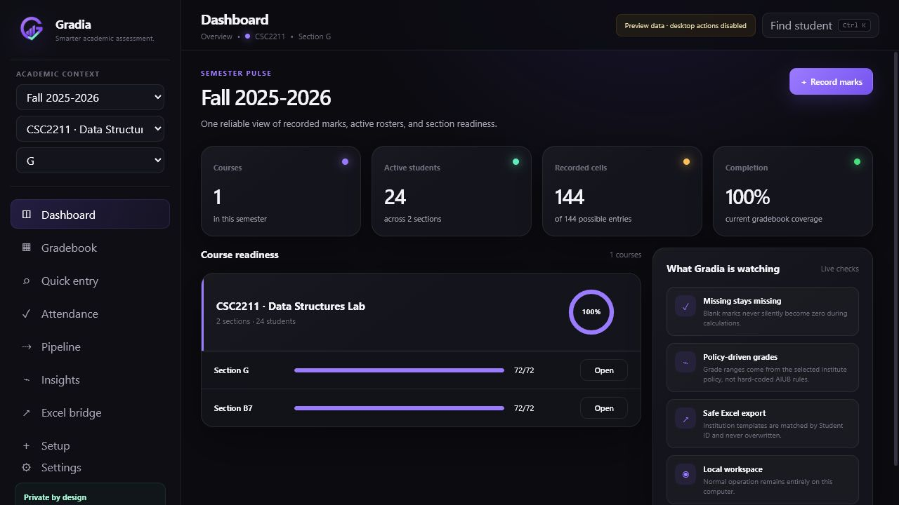
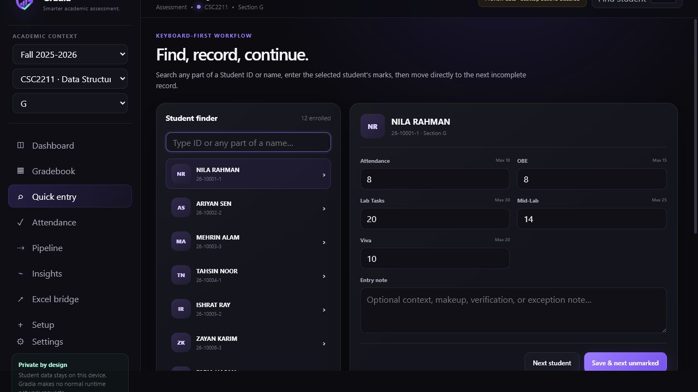
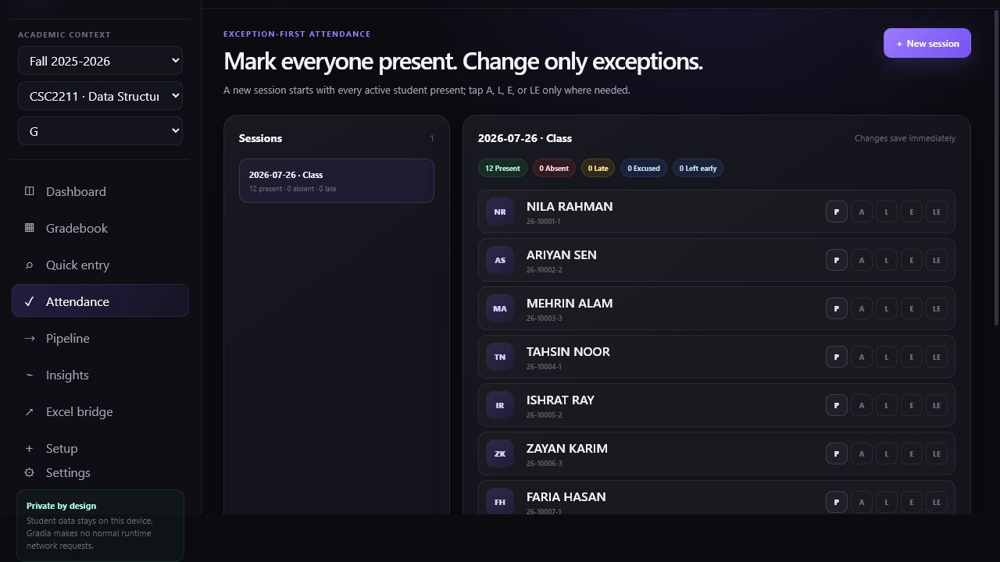
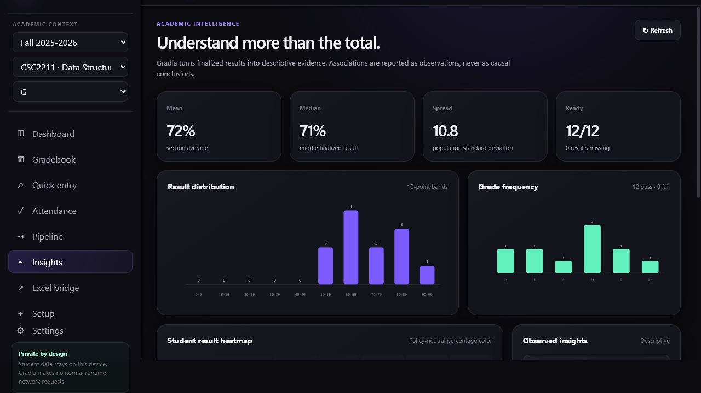
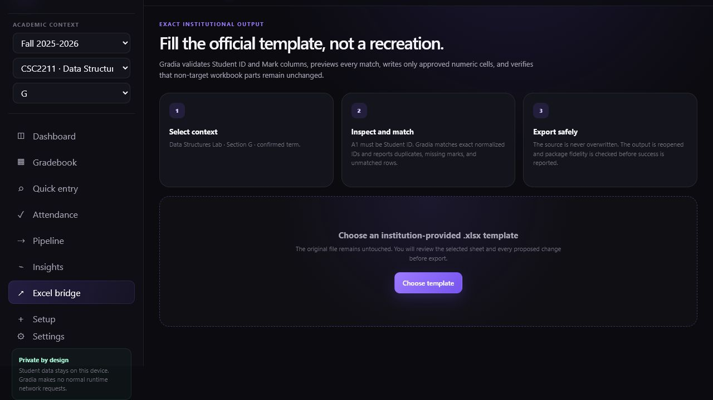

<div align="center">
  

  <h1>Gradia</h1>
  <p><strong>Smarter academic assessment.</strong></p>
  <p>A private, local-first desktop workspace for gradebooks, attendance, assessment logic, analytics, and exact institutional Excel output.</p>

  <p>
    <a href="https://github.com/the-sudipta/gradia/actions/workflows/ci.yml"></a>
    <a href="https://github.com/the-sudipta/gradia/releases/latest"></a>
    <a href="LICENSE"></a>
    <a href="https://github.com/the-sudipta/gradia/releases/latest"></a>
    <a href="https://github.com/the-sudipta/gradia/releases/latest"></a>
    <a href="https://github.com/the-sudipta/gradia/releases/latest"></a>
  </p>
  <p>
    
    
    
    
    
    
    
  </p>

  <p>
    <a href="#download">Download</a> ·
    <a href="#what-a-teacher-can-do">Features</a> ·
    <a href="#privacy-by-design">Privacy</a> ·
    <a href="docs/INDUSTRIAL_PHD_PROSPECTUS.md">Research collaboration</a> ·
    <a href="FUNDING.md">Support Gradia</a>
  </p>
</div>



Gradia is designed for teachers who have outgrown fragile, duplicated Excel workflows but still need official Excel templates at the institutional boundary. It keeps flexible assessment work inside a structured SQLite database, then writes approved marks into the institution’s original workbook without recreating its formatting.

## What a teacher can do

<table width="100%">
  <tr>
    <td width="50%" valign="top">
      <h3>📚 Organize academic work</h3>
      <p>Create semesters, courses, sections, rosters, and institute-specific grade policies. Student IDs remain authoritative text keys.</p>
    </td>
    <td width="50%" valign="top">
      <h3>⌨️ Record marks quickly</h3>
      <p>Use a spreadsheet-style gradebook or search any part of a name/ID and save marks through a focused, keyboard-friendly form.</p>
    </td>
  </tr>
  <tr>
    <td width="50%" valign="top">
      <h3>✓ Take exception-first attendance</h3>
      <p>Begin with everyone Present and change only Absent, Late, Excused, or Left Early cases.</p>
    </td>
    <td width="50%" valign="top">
      <h3>ƒ Build assessment logic</h3>
      <p>Configure mark weights, conversions, best-of rules, minimums, caps, additions, subtractions, and policy-driven grades without hard-coded institutional ranges.</p>
    </td>
  </tr>
  <tr>
    <td width="50%" valign="top">
      <h3>⌁ Understand a section</h3>
      <p>Review averages, medians, spread, distributions, grade frequencies, heatmaps, boundary cases, and descriptive observations.</p>
    </td>
    <td width="50%" valign="top">
      <h3>↗ Preserve official Excel templates</h3>
      <p>Match exact Student IDs, preview every proposed change, write only Mark cells, preserve workbook package parts, and export with the required academic filename.</p>
    </td>
  </tr>
  <tr>
    <td width="50%" valign="top">
      <h3>⇢ Track administrative progress</h3>
      <p>Manage Evaluated, Marks Recorded, and Portal Uploaded as independent section-level stages.</p>
    </td>
    <td width="50%" valign="top">
      <h3>🛡 Own and recover the data</h3>
      <p>Work without an account or normal runtime network calls, then save and restore checksummed portable Gradia backups.</p>
    </td>
  </tr>
</table>

## Designed around the actual teaching workflow

<table width="100%">
  <tr>
    <td width="50%" align="center" valign="top">
      
      <br><strong>Dynamic student search and focused mark entry</strong>
    </td>
    <td width="50%" align="center" valign="top">
      
      <br><strong>Exception-first attendance</strong>
    </td>
  </tr>
  <tr>
    <td width="50%" align="center" valign="top">
      
      <br><strong>Policy-aware descriptive analytics</strong>
    </td>
    <td width="50%" align="center" valign="top">
      
      <br><strong>Surgical institutional Excel export</strong>
    </td>
  </tr>
</table>

## Select the academic context before adding data

The three selectors under **Academic context** in the left panel are the active destination for setup and daily work. Always confirm the path **Semester → Course → Section** before creating or importing anything. Gradia now repeats the current destination at the top of **Setup** so it is visible at the moment of action.

<table width="100%">
  <thead>
    <tr>
      <th width="28%" align="left">What you want to do</th>
      <th width="34%" align="left">What must be selected first</th>
      <th width="38%" align="left">Where Gradia puts it</th>
    </tr>
  </thead>
  <tbody>
    <tr>
      <td>Add a course</td>
      <td>The intended semester</td>
      <td>Inside that selected semester</td>
    </tr>
    <tr>
      <td>Add a section</td>
      <td>The intended semester and course</td>
      <td>Inside that selected course</td>
    </tr>
    <tr>
      <td>Add or import students</td>
      <td>The intended semester, course, and section</td>
      <td>Into that selected section roster</td>
    </tr>
    <tr>
      <td>Add assessment fields</td>
      <td>The intended course; select its section to preview the active gradebook</td>
      <td>In the course structure used by its sections</td>
    </tr>
    <tr>
      <td>Enter marks, attendance, or export Excel</td>
      <td>The exact semester, course, and section</td>
      <td>Against that section’s students and records</td>
    </tr>
  </tbody>
</table>

Changing a selector changes the active workspace. Before a write, verify both the left-panel path and the course/section breadcrumb at the top of the page.

## Assessment field types

The **Type** tells Gradia what kind of value a column stores and how it behaves. The Add assessment dialog shows this explanation and an example immediately when the selection changes.

<table width="100%">
  <thead>
    <tr>
      <th width="18%" align="left">Type</th>
      <th width="49%" align="left">Meaning</th>
      <th width="33%" align="left">Example</th>
    </tr>
  </thead>
  <tbody>
    <tr><td><strong>Score</strong></td><td>A teacher-entered numeric mark validated against its maximum.</td><td>Quiz 1: 8 out of 10</td></tr>
    <tr><td><strong>Calculated</strong></td><td>A read-only result created from existing fields using sum, average, best-N, dropped-lowest, scaling, multiplication, weighting, or subtraction. Missing required inputs keep the result missing.</td><td>Semester Total = 40% Midterm + 60% Final</td></tr>
    <tr><td><strong>Attendance</strong></td><td>A numeric assessment column for an attendance-derived mark. Individual class sessions are still recorded on the Attendance screen.</td><td>Attendance Mark: 9 out of 10</td></tr>
    <tr><td><strong>Bonus</strong></td><td>A non-negative extra-credit amount that can be included in a calculated result.</td><td>Participation Bonus: 2 points</td></tr>
    <tr><td><strong>Penalty</strong></td><td>A non-negative deduction amount that can be subtracted in a calculated result.</td><td>Adjusted Project = Project − Late Penalty</td></tr>
    <tr><td><strong>Text</strong></td><td>A short written student value that is not used in numeric calculations.</td><td>Presentation: Satisfactory</td></tr>
    <tr><td><strong>Note</strong></td><td>Free-form student context that documents an exception without changing marks.</td><td>Makeup approved for 12 August</td></tr>
  </tbody>
</table>

## Gradebook views

**Term** answers “when does this assessment belong?” while **Gradebook view** answers “with which group of columns should it be organized?” A view does not change a mark or formula. The Add assessment dialog explains the selected view in the same way as the field type.

<table width="100%">
  <thead>
    <tr>
      <th width="22%" align="left">View</th>
      <th width="45%" align="left">Use it for</th>
      <th width="33%" align="left">Example fields</th>
    </tr>
  </thead>
  <tbody>
    <tr><td><strong>No specific view</strong></td><td>A field that should remain outside a named grouping. Its Term still controls the Midterm, Final, Semester, or All fields tab.</td><td>A general reference field</td></tr>
    <tr><td><strong>Midterm</strong></td><td>Assessments and totals used in the midterm part of the course.</td><td>Midterm OBE, Exam, Midterm Total</td></tr>
    <tr><td><strong>Final</strong></td><td>Assessments and totals used in the final part of the course.</td><td>Final OBE, Viva, Final Total</td></tr>
    <tr><td><strong>Semester Result</strong></td><td>Fields combining or summarizing the complete course result.</td><td>Weighted Semester Total, Letter Grade</td></tr>
    <tr><td><strong>Attendance</strong></td><td>Attendance-related summaries or converted marks; not the individual attendance sessions.</td><td>Attendance Percentage, Attendance Mark</td></tr>
  </tbody>
</table>

## Why it is safer than a raw workbook

- Missing marks remain missing; they never silently become zero.
- Every calculation is explicit and institute-independent.
- Raw entries, computed views, and finalized snapshots have separate responsibilities.
- Student ID—not a possibly duplicated name—is the Excel matching key.
- The source workbook is never overwritten.
- Backups include a format manifest and SHA-256 integrity checksum.
- Normal operation uses the local SQLite database and bundled assets only.

## Download

[Download the latest Gradia release](https://github.com/the-sudipta/gradia/releases/latest) and choose the package for your computer:

<table width="100%">
  <thead>
    <tr>
      <th width="20%" align="left">Platform</th>
      <th width="35%" align="left">Packages</th>
      <th width="45%" align="left">What to choose</th>
    </tr>
  </thead>
  <tbody>
    <tr><td><strong>Windows x64</strong></td><td>NSIS <code>.exe</code> and <code>.msi</code></td><td>Use the setup <code>.exe</code> for normal installation or MSI for managed deployment. Gradia launches without a terminal window.</td></tr>
    <tr><td><strong>macOS</strong></td><td>Apple Silicon and Intel <code>.dmg</code></td><td>Choose <code>aarch64</code> for M1/M2/M3/M4-class Macs or <code>x64</code> for Intel Macs.</td></tr>
    <tr><td><strong>Linux x64</strong></td><td><code>.AppImage</code> and Debian <code>.deb</code></td><td>Use AppImage for a portable launch or <code>.deb</code> on Debian/Ubuntu-based distributions.</td></tr>
  </tbody>
</table>

Version 0.2.0 packages are built natively on GitHub-hosted Windows, macOS, and Ubuntu runners. They are not commercially code-signed or Apple-notarized yet. Windows/macOS may therefore show an unfamiliar-developer warning; verify the published SHA-256 checksums before opening a download.

## Quick start

1. Install and open Gradia.
2. Create a semester using the convention `Term YYYY-YYYY`, such as `Fall 2025-2026`.
3. Add a course and section.
4. Import or enter the roster.
5. Configure the grading policy and assessment fields.
6. Record marks through Gradebook or Quick entry.
7. Use Attendance, Pipeline, and Insights during the semester.
8. Export an official Excel template through Excel bridge.
9. Save a Gradia backup from Settings.

The onboarding page is always reachable from **Settings → Open welcome & semester setup**; existing semesters do not need to be deleted.

## Privacy by design

Gradia stores normal application data locally in:

```text
%APPDATA%\app.gradia.desktop\gradia.db
```

The public repository contains fictional demo records only. Real databases, backups, institutional spreadsheets, exports, and student information are explicitly excluded from version control. Read [SECURITY.md](SECURITY.md) before sharing diagnostic material.

## Architecture

<table width="100%">
  <tr>
    <th width="25%" align="left">Layer</th>
    <th width="75%" align="left">Responsibility</th>
  </tr>
  <tr>
    <td>Desktop shell</td>
    <td>Tauri 2 packages the native application and exposes a narrow command boundary.</td>
  </tr>
  <tr>
    <td>Interface</td>
    <td>Vanilla JavaScript, HTML, and CSS provide a fast local UI without a remote framework runtime.</td>
  </tr>
  <tr>
    <td>Domain core</td>
    <td>Rust validates commands, calculations, grade policies, snapshots, backups, and Excel transformations.</td>
  </tr>
  <tr>
    <td>Persistence</td>
    <td>Bundled SQLite with migrations, foreign keys, transactional writes, and audit records.</td>
  </tr>
  <tr>
    <td>Excel boundary</td>
    <td>OpenXML package inspection and surgical cell writes preserve non-target workbook content.</td>
  </tr>
</table>

## Development

Prerequisites: Node.js 20+, Rust stable, and the [Tauri 2 system prerequisites](https://v2.tauri.app/start/prerequisites/).

```bash
npm ci
npm test
npm run build

cd src-tauri
cargo test --locked
```

Run the desktop application:

```bash
npm run tauri dev
```

Build native packages:

```bash
npm run tauri build
```

The implementation gates and verified baseline are documented in [GRADIA_RUNBOOK.md](docs/project_info/GRADIA_RUNBOOK.md). The complete product plan and audit record live in [GRADIA_PROJECT_MEMORY.md](docs/project_info/GRADIA_PROJECT_MEMORY.md).

## Project status

Version `0.2.0` delivers the complete core teacher workflow on Windows, macOS, and Linux: setup, roster management, flexible marks, focused entry, attendance, grading policies, calculation rules, analytics, pipeline tracking, Excel export, audit snapshots, and backup/restore. Advanced cross-semester analytics, bulk undo tooling, encrypted backups, and commercially signed/notarized distribution remain on the [roadmap](ROADMAP.md).

## Research and industrial PhD collaboration

Gradia is also a research platform for trustworthy end-user assessment programming, privacy-preserving learning analytics, spreadsheet-to-structured-data migration, auditable calculation systems, and human-centered academic administration.

The maintainer is seeking:

- an industrial PhD opportunity abroad;
- university supervisors and research groups;
- education-technology and assessment partners;
- scholarship, sponsorship, and applied-research funding;
- ethically governed pilot institutions.

See the [Industrial PhD & Research Collaboration Prospectus](docs/INDUSTRIAL_PHD_PROSPECTUS.md) and [funding routes](FUNDING.md). Proposals can begin through the maintainer’s [GitHub profile](https://github.com/the-sudipta) or [LinkedIn](https://www.linkedin.com/in/sudiptakumar/).

## Contributing, citation, and support

- Read [CONTRIBUTING.md](CONTRIBUTING.md) before proposing code or documentation.
- Follow the [Code of Conduct](CODE_OF_CONDUCT.md) and [Responsible Use Policy](RESPONSIBLE_USE.md).
- Cite the software using [CITATION.cff](CITATION.cff).
- Report vulnerabilities using [SECURITY.md](SECURITY.md), never a public exploit report.
- Use [SUPPORT.md](SUPPORT.md) to choose the correct help channel.
- A portable copy of the repository-management skill used for this publication is included at [`.github/skills/github-repository-manager`](.github/skills/github-repository-manager).

## License

Gradia is **source-available, not open source**. Non-commercial personal, educational, academic-research, and evaluation use is permitted under the conditions in [LICENSE](LICENSE). Commercial use, paid deployment, SaaS, bundling, resale, and other revenue-connected use require a separately negotiated written agreement and royalty arrangement described in [COMMERCIAL-LICENSING.md](COMMERCIAL-LICENSING.md).

Copyright protects Gradia’s original code, documentation, artwork, and other expression. It does not automatically create ownership over abstract ideas or an independently developed implementation of similar features. The custom license is a project-owner draft and should be reviewed by qualified counsel before material commercial reliance or enforcement.

<div align="center">
  <p><strong>Gradia — Smarter academic assessment.</strong></p>
  <p>Built for teachers who want flexibility without losing structure, privacy, or institutional compatibility.</p>
</div>
